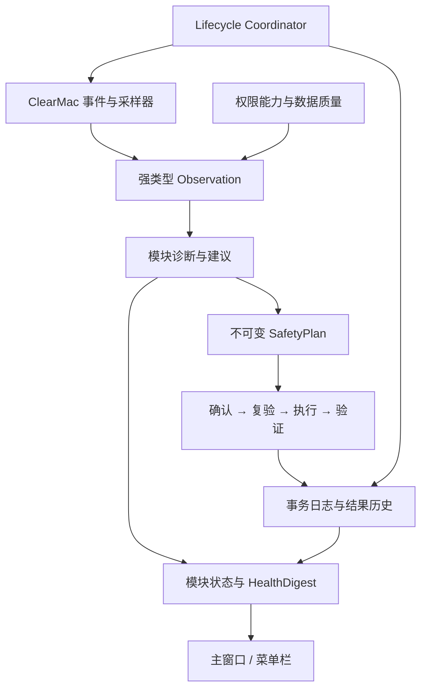

# Clear 四模块共享架构研究

- 状态：Wayfinder research ticket 的研究结论
- 对应问题：[GitHub Issue #8](https://github.com/Maidang1/clear/issues/8)
- 日期：2026-07-30
- 工程基线：[`615ba0a`](https://github.com/Maidang1/clear/tree/615ba0a463e9adb071332e515b5ba5188eb5f346)
- 范围：内存、磁盘、启动项、应用卸载的观测、诊断、建议、权限、安全事务、历史与可选菜单栏守护

## 结论

建议保留现有 `ClearCore → ClearMac → ClearApp` 三层依赖方向，不为四个产品模块复制四套服务，也暂不增加独立 Helper。演进后的职责应是：

1. `ClearCore` 保存纯领域模型、模块诊断规则、建议策略、安全事务状态机和跨模块摘要，不导入 AppKit 或 Darwin。
2. `ClearMac` 封装系统采集、FSEvents、权限能力探测、应用退出、废纸篓、`SMAppService` 与本地持久化；所有易变或权限敏感 API 都藏在可替换 Provider 后。
3. `ClearApp` 只负责组合根、SwiftUI 状态和用户确认；服务在 App 生命周期内只创建一次，页面不自行实例化系统服务。
4. 四个模块保留各自强类型 observation/finding；统一首页只消费归一化的 `HealthDigest`。不要为了“统一”引入一个装载任意字典的超级模型。
5. 所有有副作用的动作都经过同一安全事务骨架：预览、确认、执行前复验、执行、结果复验、恢复提示和审计；观察与诊断本身不进入事务。
6. 菜单栏守护首版与主窗口使用同一进程：`WindowGroup + MenuBarExtra + SMAppService.mainApp`。它只做低开销观测和提醒，不自动执行破坏性动作。
7. 后台采用事件驱动；只在窗口可见时高频刷新。FSEvents 只表示“可能变化”，不能作为最终事实；内存压力事件也不能伪装为 Activity Monitor 的连续百分比。

这是一组架构建议，不是 Apple 对第三方清理工具的官方设计。

## 已确认事实

### 当前工程

- 工程是 Swift 6、macOS 14+ 的三个 SwiftPM target：`ClearCore`、依赖它的 `ClearMac`，以及依赖两者的 `ClearApp`。[`Package.swift`](https://github.com/Maidang1/clear/blob/615ba0a463e9adb071332e515b5ba5188eb5f346/Package.swift)
- 当前 CI 分别在 Apple Silicon 和 Intel runner 上测试，并构建 `arm64 + x86_64` Universal App。[CI](https://github.com/Maidang1/clear/blob/615ba0a463e9adb071332e515b5ba5188eb5f346/.github/workflows/ci.yml)
- `SystemMemorySampler` 已是 actor，并以缺失字段和采样质量表达 Mach/sysctl 的部分失败；压力值是 Clear 的启发式估算，不是 Apple 的公开算法。[采样器](https://github.com/Maidang1/clear/blob/615ba0a463e9adb071332e515b5ba5188eb5f346/Sources/ClearMac/Memory/SystemMemorySampler.swift)
- `RunningApplicationService` 在 `MainActor` 上同步枚举 GUI 应用并逐一调用 `proc_pid_rusage`；当前页面高频刷新会把系统调用放在 UI 隔离域中。[运行应用服务](https://github.com/Maidang1/clear/blob/615ba0a463e9adb071332e515b5ba5188eb5f346/Sources/ClearMac/Applications/RunningApplicationService.swift)
- 磁盘清理已经具备本研究建议推广的安全种子：不可变计划、可信规则复验、路径/文件身份复验、应用运行检查、废纸篓移动以及“已移动但无法复验”的不确定结果。[清理协调器](https://github.com/Maidang1/clear/blob/615ba0a463e9adb071332e515b5ba5188eb5f346/Sources/ClearCore/Cleaning/CleanupCoordinator.swift)；[安全文件系统](https://github.com/Maidang1/clear/blob/615ba0a463e9adb071332e515b5ba5188eb5f346/Sources/ClearCore/Cleaning/CleanupFileSystem.swift)
- 当前组合根分别创建内存与清理服务；应用清单状态没有共享。历史仅在 `UserDefaults` 中保存最多 50 条清理摘要，不适合时间序列或崩溃恢复日志。[组合根](https://github.com/Maidang1/clear/blob/615ba0a463e9adb071332e515b5ba5188eb5f346/Sources/ClearApp/Views/RootView.swift)；[历史存储](https://github.com/Maidang1/clear/blob/615ba0a463e9adb071332e515b5ba5188eb5f346/Sources/ClearApp/Support/AppStores.swift)
- Release 构建使用 `codesign --sign -`，即 ad-hoc 完整性签名，而不是稳定开发者身份。[构建脚本](https://github.com/Maidang1/clear/blob/615ba0a463e9adb071332e515b5ba5188eb5f346/scripts/build_universal_app.sh)

### Apple 平台边界

- `DispatchSourceMemoryPressure` 提供系统内存压力状态变化事件；Apple 暴露的是 normal、warning、critical 条件，不是 Activity Monitor 压力图的公开连续公式。[Dispatch memory pressure](https://developer.apple.com/documentation/dispatch/dispatchsourcememorypressure)；[Activity Monitor 指标说明](https://support.apple.com/guide/activity-monitor/view-memory-usage-actmntr1004/mac)
- Apple 将 memory footprint 定义为实际内存使用的重要口径，包含 dirty、compressed 和 swapped pages，并说明可通过 `proc_pid_rusage` 获取；Apple Silicon 上还会反映统一内存中的 Metal 资源。[WWDC22: Profile and optimize your game's memory](https://developer.apple.com/videos/play/wwdc2022/10106/)
- Apple 当前 XNU `libproc.h` 将 `proc_pid_rusage` 所在接口标为可能变化的私有进程信息接口。因此它可以作为当前适配器，但不能渗透进领域模型，失败也不能让整次诊断失败。[XNU `libproc.h`](https://github.com/apple-oss-distributions/xnu/blob/main/libsyscall/wrappers/libproc/libproc.h)
- `NSWorkspace.runningApplications` 可提供系统识别的运行应用；启动/退出通知可增量维护清单。`NSRunningApplication.terminate()` 返回时目标可能尚未完成退出，所以固定等待一秒不能证明事务完成。[runningApplications](https://developer.apple.com/documentation/appkit/nsworkspace/runningapplications)；[应用启动通知](https://developer.apple.com/documentation/appkit/nsworkspace/didlaunchapplicationnotification)；[正常退出](https://developer.apple.com/documentation/appkit/nsrunningapplication/terminate%28%29)
- FSEvents 是 advisory change stream。事件可能合并；出现 `MustScanSubDirs`、事件丢失或监控根变化时，消费者必须重新扫描。Apple 还要求先开始监控、再构建目录快照，才能避免扫描窗口内漏掉变化。[File System Events Programming Guide](https://developer.apple.com/library/archive/documentation/Darwin/Conceptual/FSEvents_ProgGuide/UsingtheFSEventsFramework/UsingtheFSEventsFramework.html)
- Apple 提供 `willSleepNotification` 与 `didWakeNotification`。睡眠前处理本身可能延迟系统睡眠，因此只能做取消、短日志收尾和状态落盘，不能启动扫描。[willSleepNotification](https://developer.apple.com/documentation/appkit/nsworkspace/willsleepnotification)；[didWakeNotification](https://developer.apple.com/documentation/appkit/nsworkspace/didwakenotification)
- `MenuBarExtra` 可在主应用不活跃时提供菜单栏入口。macOS 13+ 的 `SMAppService` 可注册并控制本应用的登录项、LaunchAgent 或 LaunchDaemon，状态可能要求用户在系统设置中批准。[MenuBarExtra](https://developer.apple.com/documentation/swiftui/menubarextra)；[SMAppService](https://developer.apple.com/documentation/servicemanagement/smappservice)；[`requiresApproval`](https://developer.apple.com/documentation/servicemanagement/smappservice/status-swift.enum/requiresapproval)
- Apple 建议空闲时避免轮询和不必要 UI/I/O；事件通知优先于 timer，非用户工作应使用 utility/background QoS，并在应用不可见、低电量或热状态升高时主动降载。[Energy Efficiency Guide](https://developer.apple.com/library/archive/documentation/Performance/Conceptual/power_efficiency_guidelines_osx/BestPractices.html)；[Minimize Timer Usage](https://developer.apple.com/library/archive/documentation/Performance/Conceptual/power_efficiency_guidelines_osx/Timers.html)；[QoS 指南](https://developer.apple.com/library/archive/documentation/Performance/Conceptual/power_efficiency_guidelines_osx/PrioritizeWorkAtTheTaskLevel.html)
- Full Disk Access 必须由用户在系统设置中明确授予；macOS 14 还保护其他应用容器。TCC 没有公开“查询或授予 FDA”的 API，真实文件访问结果才是能力事实。[Apple Platform Security](https://support.apple.com/guide/security/controlling-app-access-to-files-secddd1d86a6/web)；[`NSAppDataUsageDescription`](https://developer.apple.com/documentation/bundleresources/information-property-list/nsappdatausagedescription)
- Apple DTS 明确说明 TCC 记忆依赖稳定代码签名身份；unsigned/ad-hoc 的版本 N+1 可能无法被识别为版本 N，从而产生过多提示或重新授权。Clear 可以继续选择 ad-hoc 分发，但“FDA 会跨升级稳定保留”不能成为产品承诺。[Apple DTS: On File System Permissions](https://developer.apple.com/forums/thread/678819)

## 推荐边界

### `ClearCore`

| 区域 | 责任 | 不负责 |
|---|---|---|
| Observation | 时间、来源、世代、质量、缺失原因、强类型 payload | 调用系统 API |
| Diagnosis | 由 observation 生成可复现 finding；保留证据引用、置信度、有效期 | 发通知或执行动作 |
| Recommendation | 从 finding 生成理由、风险、权限前提与可选动作 | 默认替用户执行 |
| Safety | 不可变计划、确认要求、复验状态机、结果分类 | 直接操作文件或进程 |
| Overview | 将模块 finding 投影为统一 `HealthDigest` | 抹平模块语义为单一分数 |
| History contracts | 版本化事件、保留策略、迁移协议 | 选择 SQLite 或文件格式 |

`ClearCore` 中允许模块拥有不同 payload：

- `MemoryObservation`：VM 快照、系统压力事件、进程 footprint 可用性。
- `DiskObservation`：可信根快照、候选、容量、扫描遗漏与权限缺口。
- `StartupObservation`：项目来源、加载状态、所有者、签名/路径证据与可管理性。
- `UninstallObservation`：应用身份、运行状态、关联文件证据、共享程度与权限缺口。

跨模块只共享 envelope、finding/recommendation 的公共元数据和 `HealthDigest`。不要持久化 `[String: Any]`，也不要让一个巨大 enum 每增加模块就改遍全工程。

### `ClearMac`

建议按 adapter 而不是页面拆分：

- `MemoryObservationProvider`：Mach VM、swap、Dispatch pressure。
- `ApplicationInventory`：一次全量快照加 NSWorkspace 启动/退出事件；进程 footprint 在非 MainActor actor 中采样。
- `FileTreeSnapshotProvider` 与 `FileChangeSource`：有界扫描、FSEvents debounce、丢事件后的完整重建。
- `PermissionCapabilityService`：按“具体作用域 + 操作”表达 available、denied、requiresUserAction、unknown；不维护一个虚假的全局 `hasFullDiskAccess` 布尔值。
- `ActionExecutors`：废纸篓、应用正常退出、启动项变更等窄接口。
- `LifecycleEventSource`：窗口可见性、会话状态、低电量/热状态、睡眠/唤醒。
- `LoginItemController`：仅管理 Clear 自身的 `SMAppService.mainApp`。
- `LocalHistoryStore` 与 `TransactionJournal`：实现 Core 中的持久化协议。

`proc_pid_rusage`、FSEvents、TCC 错误码和 `SMAppService` 状态都属于适配器细节。上层只看到数据质量、能力状态和可恢复建议。

### `ClearApp`

- `AppCompositionRoot` 创建且共享模块运行时、权限服务、历史库和事务协调器。
- `MonitoringCoordinator` actor 依据生命周期选择采样 profile，不让 View 自己创建 timer。
- 每个模块一个 `@MainActor` presentation store，只消费不可变 view state。
- `HealthOverviewStore` 只聚合四个模块 digest。
- 菜单栏与主窗口订阅同一状态源；菜单栏不复制采样器。
- 确认 sheet 只提交已创建的 `SafetyPlan.id`；UI 不能把路径或 PID 临时拼成执行请求。

首版保持一个 executable target。独立菜单栏 Helper 会立即增加 IPC 版本兼容、更新原子性、权限归属和签名身份问题，在当前 ad-hoc 分发下收益不足。

## 数据流

数据规则：

1. 每个 observation 带 wall-clock 时间和 monotonic generation；睡眠、唤醒、采样器重启后开启新 generation，禁止跨断点计算速率。
2. 部分成功是正常结果。权限拒绝、进程消失或某个计数器失败，表现为 scoped gap，不是空数组或零值。
3. Diagnosis 是确定性纯逻辑：同一 observation 和规则版本应产生同一 finding。
4. Recommendation 必须引用 finding/evidence，并声明风险、可逆性、权限和预期验证方式。
5. 首页健康状态同时展示严重度和数据完整度；没有数据不等于健康。

## 统一安全事务

建议状态机：

`draft → previewed → confirmed → preflighting → executing → verifying → completed | partial | failed | uncertain`

共同不变量：

1. 计划不可变，包含规则版本、目标身份指纹、生成时间、TTL、权限要求和恢复策略。
2. 用户确认的是完整预览；目标或规则变化后旧确认失效。
3. 执行前重新观察：权限、目标身份、应用运行状态、卷和父目录均不能只信扫描时快照。
4. 同一作用域只允许一个 mutation transaction；后台观察可以继续，但不能覆盖事务使用的证据。
5. 每个 item 独立记录 `notStarted / succeeded / failed / uncertain`，批量动作不能用一个总布尔值。
6. 在第一项 mutation 前写 journal；每项完成后追加结果。启动时发现未完成 journal，只做 reconcile，不自动重试。
7. 取消在下一安全边界生效；已发生的 mutation 仍必须验证。
8. 无法确认最终状态时使用 `uncertain` 并指引人工检查，不能把它包装成普通失败或成功。

| 模块 | 身份复验 | 默认动作 | 结果验证 |
|---|---|---|---|
| 内存 | bundle ID + PID + launch date；目标仍为同一应用 | 正常退出 | NSWorkspace 退出事件 + 超时后重查；显示实际前后差值 |
| 磁盘 | root/volume/file ID、metadata、非 symlink | 移到废纸篓 | 目标消失且废纸篓对象身份匹配 |
| 启动项 | 来源、文件 ID、内容摘要、所有者、当前加载状态 | 模块定义的可逆禁用或打开系统设置 | 重新枚举来源并核对加载状态；不以命令返回码代替状态 |
| 卸载 | app bundle ID、卷/文件 ID、运行状态；每个关联物独立证据 | App 与明确归属项目移到废纸篓 | App/关联物重新枚举；共享或未知归属项目保留 |

内存观察本身不是“清理事务”。只有退出应用等副作用动作进入该状态机。菜单栏永远不能跳过 `previewed` 和 `confirmed`。

## 权限模型

权限应是作用域化 capability，而不是设置页中的一次性开关：

| 字段 | 示例 |
|---|---|
| capability | `readMetadata`、`enumerateChildren`、`moveToTrash`、`terminateApplication` |
| scope | 某条受信根、某 App bundle、某启动项来源 |
| status | available、denied、requiresUserAction、unsupported、unknown |
| evidence | 最近一次真实探测、错误码、时间 |
| remediation | 重试、选择目录、打开系统设置、缩小范围 |

推荐顺序：

1. 默认低权限模式先运行并展示完整的 partial result。
2. 只在用户进入需要更广访问的功能时解释收益并提供 FDA 系统设置入口。
3. 授权后对所需作用域做真实只读探测；不要声称能读取 TCC/FDA 总开关。
4. mutation 执行前再次检查写能力。
5. 记录“缺失范围”，不记录被拒绝目录中的内容。

当前 ad-hoc 分发必须在界面和发布说明中明确：升级可能需要重新授权。是否接受这一体验是产品决策，不是架构能够消除的问题。

## 观测、历史与保留

### 采样 profile

| 运行状态 | 内存系统指标 | 进程 footprint | 磁盘/启动项/应用目录 |
|---|---:|---:|---|
| 内存页可见 | 1 秒 | 5 秒，分批且非主线程 | 只消费已有摘要 |
| 其他主窗口可见 | 5 秒 | 15 秒或停止 | 用户触发扫描；FSEvents 只标脏 |
| 菜单栏安静状态 | 压力事件 + 最慢 60 秒 heartbeat | 不做全量枚举 | 事件驱动、5–10 秒 debounce，不做递归扫描 |
| warning/critical | 立即系统采样 | 一次有界 Top-N 快照 | 暂停重型扫描 |
| 低电量/热状态 serious | 压力事件 + 最慢 120 秒 heartbeat | 停止 | 只记录事件 |
| 会话不活跃/睡眠 | 停止 | 停止 | 停止 |
| 唤醒 | 新 generation；立即轻量采样 | 延迟 2–5 秒重建应用清单 | 标脏，等用户打开或系统空闲后刷新 |

所有 timer 必须可取消并带容差。FSEvents 的作用是让索引失效，不是在回调中直接递归扫描。

### 存储建议

- 当前 `UserDefaults` 仅继续保存偏好；时间序列、finding、action result 和 journal 使用一个本地版本化 store。
- store 接口位于 `ClearCore`，SQLite 或等价实现位于 `ClearMac`。具体选择应通过后续原型验证，不是本研究的硬事实。
- 内存原始 1 秒样本只保存在有界 ring buffer，建议 15 分钟；写盘前聚合为 1 分钟桶。
- 建议保留：1 分钟桶 24 小时、15 分钟桶 30 天；findings 与 action results 90 天；未完成 journal 直到 reconcile。
- 只在桶完成、finding 改变或事务推进时落盘。heartbeat 不写盘。
- 数据库损坏时隔离旧文件并降级为内存历史；磁盘满时停止历史写入，但不得阻止观察、预览和安全复验。

## 生命周期

`MonitoringCoordinator` 建议维护以下显式状态：

`disabled`、`foregroundVisible`、`backgroundGuardian`、`sessionInactive`、`sleeping`、`resynchronizing`

- 主窗口可见时选择 foreground profile；仅菜单栏存在时选择 guardian profile。
- 收到 `willSleep`：取消 timer/FSEvent 消费任务，结束当前 observation generation，只写最小 journal 状态。绝不为“赶在睡眠前完成”启动扫描。
- 收到 `didWake`：进入 `resynchronizing`，开启新 generation；先恢复压力源和应用清单，再把文件模块标脏。
- session inactive 时停止进程枚举与 UI history；重新激活后按 wake 的轻量流程复验。
- 低电量或热状态 serious/critical 覆盖其他 profile，进一步降频并禁止非用户触发扫描。
- 系统内存 critical 时 Clear 应优先缩小自己的 ring buffer、暂停进程 Top-N 和文件索引，而不是增加采样负担。

## 可量化资源预算

Apple 没有为此类工具规定数值。下表是 Clear 建议的首版验收线，必须同时在一台受支持 Intel Mac 与一台 Apple Silicon Mac 的 Release Universal build 上测量；任一架构不通过即不通过。

CPU 百分比按 Activity Monitor 的口径记录（100% 约等于占满一个逻辑核心）。安静场景先预热 5 分钟，再采样 30 分钟，报告 median、p95 和峰值持续时间。

| 场景 | CPU | physical footprint | 唤醒与 I/O | 响应预算 |
|---|---|---|---|---|
| 守护关闭且窗口全关 | 进程退出，0 | 0 | 0 | 不保持隐藏后台进程 |
| 菜单栏安静 30 分钟 | median ≤ 0.2%，p95 ≤ 1%；>5% burst 不超过 2 秒 | steady ≤ 50 MiB；增长 ≤ 5 MiB/小时 | package wakeups median ≤ 2/分钟；写 ≤ 64 KiB/分钟；读 ≤ 1 MiB/分钟 | 压力事件到状态更新 p95 ≤ 1 秒 |
| 内存中心可见 10 分钟 | median ≤ 2%，p95 ≤ 8% | steady ≤ 80 MiB；增长 ≤ 10 MiB/小时 | 无网络；历史写平均 ≤ 128 KiB/分钟 | 系统样本 p95 ≤ 50 ms；进程批次 p95 ≤ 500 ms；MainActor 单次提交 p95 ≤ 16 ms |
| 用户触发文件扫描 | 平均不超过一个逻辑核心；utility QoS | ≤ 150 MiB，候选/条目达到上限后不再增长 | 无网络；不产生与结果无关的持久写 | 取消到停止新枚举 p95 ≤ 250 ms；主线程 stall p95 < 50 ms |
| 睡眠与唤醒 | 睡眠期间 0 | 唤醒后回到原 steady budget | 睡眠期间无采样/历史写 | wake 后 5 秒内恢复轻量状态；不跨断点计算速率 |

测量手段：

- 用 XCTest performance tests 固化采样、诊断、聚合和大目录 fixture 的 CPU、内存、存储回归基线；Apple 的 performance tests 支持基线退化检查，并提供 CPU 与 memory metrics。[XCTest Performance Tests](https://developer.apple.com/documentation/xctest/performance-tests)；[`XCTCPUMetric`](https://developer.apple.com/documentation/xctest/xctcpumetric)；[`XCTMemoryMetric`](https://developer.apple.com/documentation/xctest/xctmemorymetric)
- 用 `OSSignposter` 标记 refresh、diagnose、plan、preflight、execute、verify，交给 Instruments 比较两种架构。[Recording performance data](https://developer.apple.com/documentation/os/recording-performance-data)
- Release 前在两类真实硬件上用 Instruments Activity Monitor/Time Profiler 和 `powermetrics` 复核 CPU、wakeups、QoS 和磁盘活动；Apple 的能耗指南明确推荐这些工具。[Monitor energy usage](https://developer.apple.com/library/archive/documentation/Performance/Conceptual/power_efficiency_guidelines_osx/MonitoringEnergyUsage.html)

CI runner 只能守住功能和微基准回归；长期 App Nap、睡眠/唤醒、TCC 与硬件能耗验收需要真实机矩阵。

## 失败模式与要求

| 失败模式 | 所需行为 |
|---|---|
| 单个 Mach/sysctl/libproc 调用失败 | 对应字段 unknown，保留其他 observation；记录 source issue |
| PID 退出或复用 | 使用 PID + launch time 复验；不对旧快照执行动作 |
| FSEvents 合并、丢失、root changed | 标记索引 stale，做有界完整重建；不把缺少事件当作“没有变化” |
| 权限被拒绝或升级后 TCC 失效 | 输出 scoped permission gap；基础模块继续工作；不自动反复触发提示 |
| 睡眠期间计数器/时间断点 | 新 generation；跨断点 delta/rate 为 unknown |
| 同一目标被外部程序改变 | preflight 失败，旧确认失效，要求重新扫描 |
| 部分批量动作成功 | 保留逐项结果；已成功项不重试；未知项人工 reconcile |
| 执行后验证失败 | 标为 uncertain，展示最后已知位置/状态；不谎报成功 |
| store 损坏或磁盘满 | 隔离/停止历史写入；事务安全复验不依赖非关键历史 |
| 菜单栏进程被杀或 crash | 下次启动读取 journal 并 reconcile；不能自动重放 mutation |
| `SMAppService` requires approval | 显示系统设置入口；主窗口仍可手动运行 |
| 低电量、热状态或 memory critical | 降频、释放缓存、暂停扫描；不为“监控准确”与系统争资源 |
| UI 消费慢 | AsyncStream 只保留最新状态或有界 buffer；不得无界积压 |

## 需要后续决策或原型验证

1. **ad-hoc + FDA 升级体验**：用两个连续 GitHub Release 包验证升级、移动 App 路径和重新下载后的 TCC/FDA、App Management 与 App Data 行为；决定是否接受重新授权。
2. **同进程登录启动**：验证 `SMAppService.mainApp` 在 ad-hoc Release 更新后的状态继承，并确认登录启动时只显示菜单栏、不自动弹主窗口。
3. **`proc_pid_rusage` 风险**：明确接受其接口变化风险，或把进程 footprint 降级为实验能力；无论选择哪一项都保留 Provider 隔离和契约测试。
4. **应用族口径**：现有数据是 GUI 主进程，不是 Chrome/IDE 等多进程应用的可靠总量；“应用族”聚合需要独立研究，未解决前 UI 必须准确命名。
5. **启动项可逆动作**：不同来源的“禁用”语义和官方可管理 API不同，应由启动项模块研究决定；共享事务层只提供状态机。
6. **本地 store**：用 24 小时时序、10 万文件索引和事务 crash fixture 比较 SQLite 与简单 append-only 文件，验证预算后再定实现。

## 推荐的实施顺序

本研究不包含产品代码。若 Wayfinder 采纳此架构，建议后续计划按以下依赖顺序拆票：

1. 建立共享 observation、quality、finding、recommendation、permission gap 和 health digest 术语。
2. 把现有磁盘清理抽成通用安全事务状态机，同时保持当前文件系统复验不退化。
3. 建立单一 composition root、lifecycle coordinator 与 history/journal 接口。
4. 先迁移内存和磁盘两个已存在模块，证明强类型模块能够投影到统一首页。
5. 完成资源微基准与 Intel/Apple Silicon 真实机门槛。
6. 再接入启动项、卸载和可选菜单栏守护；每个模块只增加自己的 observation/diagnosis/executor。

最终验收标准不是“所有模块看起来统一”，而是：同一安全承诺、同一失败语义、同一资源预算，同时保留各模块真实且可测试的领域边界。
